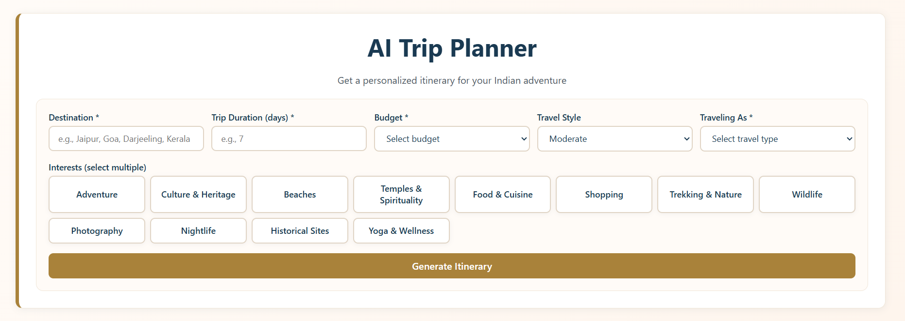
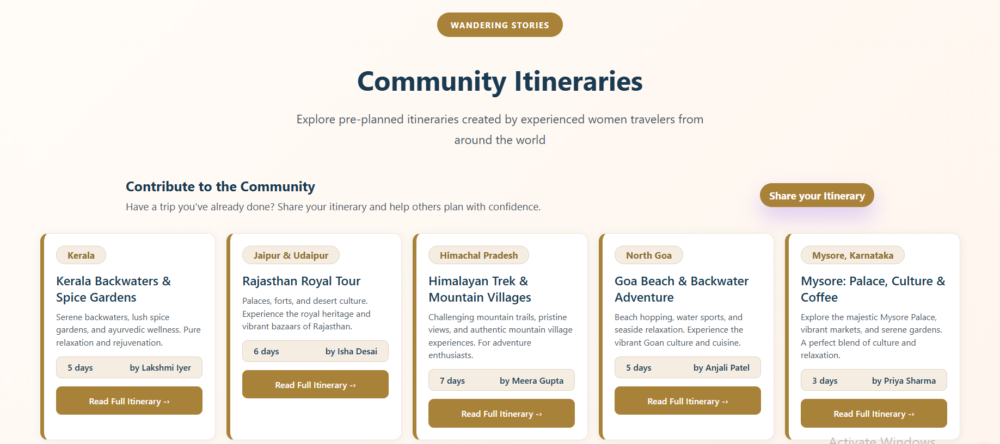
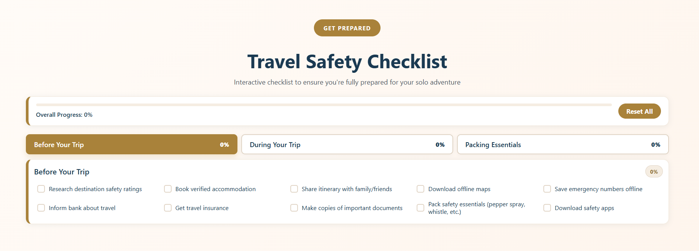
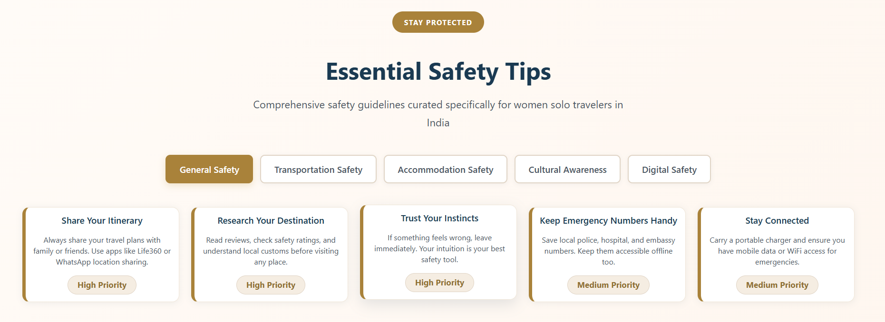
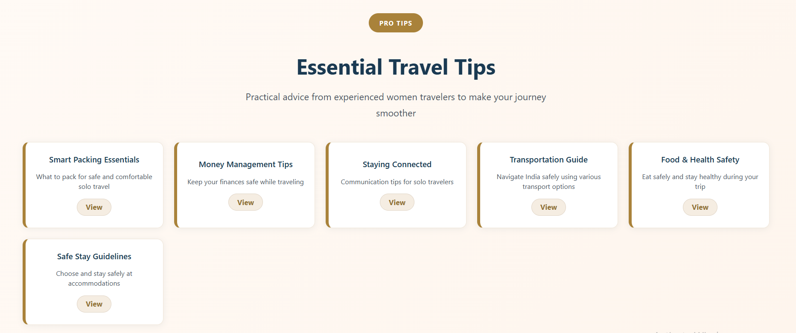

# WanderHer 🌍✈️

**WanderHer** is an elegant, safety-focused travel platform and community hub designed specifically for women and solo adventurers. The application provides tools to plan journeys, share real-world travel itineraries, and access essential safety guides and checklists.

---

## ✨ Features

- 🤖 **AI-Powered Trip Planner**: Craft detailed, custom travel itineraries powered by AI (via the Groq API).
- 🗺️ **Community Itineraries**: Browse and import itineraries shared by fellow female travelers, complete with safety ratings, difficulty levels, and duration.
- 🧳 **Interactive Checklist**: A categorized packing and preparation list to keep you organized before and during your trips.
- 🛡️ **Curated Safety & Travel Tips**: Essential advice on solo travel safety, local customs, and situational awareness.
- 📞 **Emergency Contacts**: One-click access to international emergency services, hotlines, and travel support numbers.
- 🔐 **Secure Authentication**: User sign-up and login utilizing Express, JWT (JSON Web Tokens), bcrypt hashing, and libSQL/SQLite database.

---

## 📸 Screenshots

### 1. Home / Hero Section


### 2. AI Trip Planner


### 3. Community Itineraries


### 4. Travel Safety Checklist


### 5. Essential Safety Tips


### 6. Travel Tips


### 7. Emergency Contacts & Tips


---

## 🛠️ Tech Stack

### Frontend
- **Framework**: React (built with Vite)
- **Styling**: Premium, responsive custom CSS (glassmorphic cues, fluid hover interactions, cohesive dark-tint UI)
- **API Communication**: Native fetch with automatic CORS resolution for local network testing.

### Backend
- **Server**: Node.js & Express
- **Database**: SQLite/libSQL (local development database with optional Turso cloud support)
- **Validation & Security**: Zod (input parsing), bcrypt (secure password hashing), jsonwebtoken (JWT-based session authentication)

---

## 🚀 Getting Started

To run the application locally on your machine, follow the steps below to configure and launch both the frontend and backend.

### Prerequisites
- Node.js (version 18 or higher recommended)
- npm (Node Package Manager)

---

### 1. Backend Setup

1. Open a terminal and navigate to the `server` directory:
   ```bash
   cd server
   ```

2. Install dependencies:
   ```bash
   npm install
   ```

3. Configure environment variables. Duplicate the `.env.example` file and rename it to `.env`:
   ```bash
   cp .env.example .env
   ```

4. Open `.env` and verify the values:
   ```env
   PORT=8080
   JWT_SECRET=your-secure-secret-key-here
   JWT_EXPIRES_IN=7d
   DATABASE_URL="file:./dev.db"
   ```

5. Start the backend development server (includes hot reloading):
   ```bash
   npm run dev
   ```
   The backend will run on `http://localhost:8080` (and auto-seeds mock itineraries if the database is empty).

---

### 2. Frontend Setup

1. Open a new terminal in the project root directory.

2. Install dependencies:
   ```bash
   npm install
   ```

3. Configure environment variables. Duplicate the `.env.local.example` file and rename it to `.env.local`:
   ```bash
   cp .env.local.example .env.local
   ```

4. Edit `.env.local` to include your Groq API Key (required for the AI Trip Planner):
   ```env
   VITE_API_URL=http://localhost:8080
   VITE_GROQ_API_KEY=your_groq_api_key_here
   ```

5. Start the Vite development server:
   ```bash
   npm run dev
   ```
   Open your browser and navigate to the address shown in the terminal (usually `http://localhost:5173`).

---

## 📂 Project Structure

```text
wanderHer/
├── screenshots/              # Application UI screenshots
├── server/                   # Express Backend
│   ├── prisma/               # Prisma migrations and schema (if configured)
│   ├── .env.example          # Template for backend secrets
│   ├── dev.db                # SQLite database (generated on start)
│   ├── index.js              # Express app, middleware, database initialization, & endpoints
│   ├── package.json          # Backend configuration and dependency list
│   └── seedData.js           # Seed data for initial itineraries
│
├── src/                      # React Frontend
│   ├── api/                  # API client handlers (itinerary api calls)
│   ├── auth/                 # Authentication service handlers
│   ├── components/           # UI Components (Navbar, Checklist, AITripPlanner, etc.)
│   ├── data/                 # Local data constants and static resources
│   ├── styles/               # Component-specific CSS files
│   ├── App.jsx               # App layout and route mounting
│   ├── index.css             # Main styling, typography variables, and utility classes
│   └── main.jsx              # React mounting root
│
├── .env.local.example        # Template for frontend environment variables
├── index.html                # Main entry HTML
├── package.json              # Frontend scripts and configuration
└── vite.config.js            # Vite custom dev configuration
```

---

## 🔒 Security & Auth Flow

1. **Sign Up / Log In**: User submits credentials through the frontend auth modal. The backend validates formatting using `zod`, hashes the password with `bcrypt`, and registers/checks the record in the libSQL database.
2. **Token Generation**: On successful authentication, the backend signs a JWT with a `sub` payload (user ID).
3. **Session Persistence**: The frontend stores the token in local storage and manages application login state.
4. **Authorized Requests**: Protected operations (like creating/deleting community itineraries) attach the token in the `Authorization: Bearer <token>` header, verified on the backend via the `authMiddleware`.
